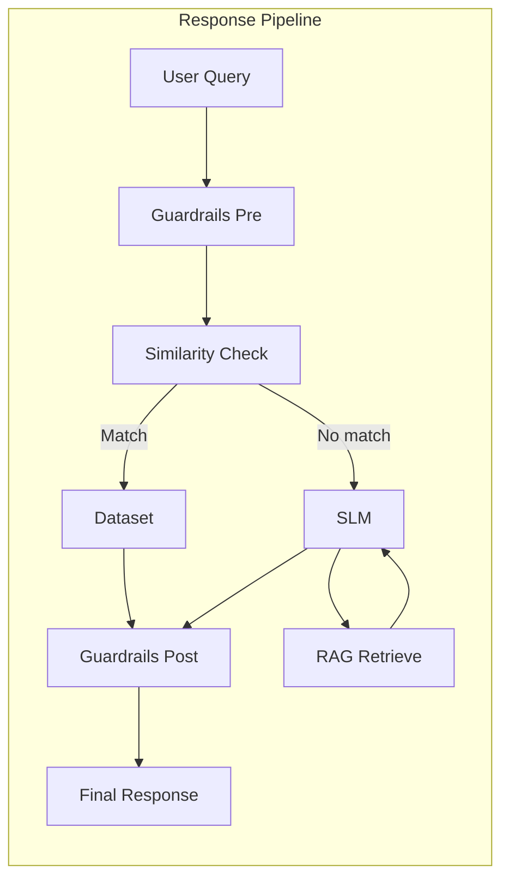

# BFSI Call Center AI Assistant – Technical Architecture

## Overview

The system implements a three-tier response pipeline as specified in the PRD:

1. **Tier 1 (Dataset)** – User query is compared to the Alpaca BFSI dataset via semantic similarity. If the best match is above a configurable threshold, the stored response is returned (no LLM generation).
2. **Tier 2 (SLM)** – If there is no Tier 1 match, a small language model (optionally fine-tuned on the same dataset) generates a response.
3. **Tier 3 (RAG)** – For “complex” queries (e.g. EMI, interest, penalty, policy), relevant chunks are retrieved from the knowledge base and passed as context to the SLM, which produces a grounded answer.

Guardrails run before (out-of-domain, PII) and after (disclaimer) the pipeline.

## Architecture diagram

## Data flow

1. **Input**: User query (text).
2. **Guardrails pre**: Reject if out-of-domain or if likely PII is detected; otherwise pass query through.
3. **Tier 1**: Embed query with the same model used for the dataset (e.g. `all-MiniLM-L6-v2`). Query the vector index (Chroma) over the Alpaca (instruction + input) texts. If best cosine similarity ≥ threshold (default 0.88), return the corresponding stored `output`.
4. **Tier 2 / 3**: If no Tier 1 match, check whether the query is “complex” (keyword heuristic: e.g. EMI, interest, rate, penalty, policy). If complex, retrieve top-k chunks from the RAG index (Chroma over knowledge docs) and pass them as context to the SLM. Otherwise call the SLM with only the instruction. SLM generates in Alpaca-style format.
5. **Guardrails post**: Append a configurable disclaimer to the response if enabled.
6. **Output**: Final response plus metadata (tier used, optional RAG sources).

## Components

| Component   | Role | Implementation |
|------------|------|----------------|
| **Dataset** | Primary response layer; 150+ Alpaca samples | `data/alpaca_bfsi.json`; schema: instruction, input, output |
| **Similarity** | Tier 1 match | `src/similarity.py` – SentenceTransformer + Chroma (cosine) |
| **SLM** | Tier 2 generation | `src/slm.py` – Hugging Face Transformers, optional PEFT adapters |
| **RAG** | Tier 3 retrieval | `src/rag.py` – Same embedder, Chroma over `knowledge/*.md` chunks |
| **Orchestrator** | Tier selection and flow | `src/orchestrator.py` |
| **Guardrails** | Pre/post safety | `src/guardrails.py` – Out-of-domain, PII, disclaimer |

## Configuration

- **config.yaml**: Similarity threshold, embedding model, dataset/index paths; SLM base model, adapter path, max_new_tokens, temperature; RAG top_k, chroma path, knowledge path, complex_keywords; guardrail messages and disclaimer; logging.
- **.env**: Optional overrides (e.g. `SIMILARITY_THRESHOLD`, `LOG_LEVEL`).

## Tier logic and thresholds

- **Similarity threshold**: Default 0.88. Increase for stricter Tier 1 matches; decrease to allow more dataset hits. Configurable in `config.yaml` or env.
- **Complex query**: Any of the configured keywords (e.g. emi, interest, rate, penalty, policy, breakdown, schedule, formula) in the query triggers RAG retrieval before SLM generation.
- **RAG top_k**: Number of chunks passed to the SLM (default 3).

## Guardrails

- **No guessing**: Specific rates/amounts are only from the dataset (Tier 1) or from RAG context (Tier 3). Tier 2 is used for general phrasing without inventing numbers.
- **No fake rates/policies**: Same as above; numbers are traceable to dataset or knowledge base.
- **No PII**: Queries containing long digit strings or Aadhaar-like patterns are rejected with a standard message; do not log full query.
- **Out-of-domain**: Queries with no BFSI-related keyword are rejected with a configurable message.
- **Compliance**: Logging avoids sensitive data; disclaimer is appended when enabled.

## Updating the system

1. **Dataset**: Add or edit entries in `data/alpaca_bfsi.json` (Alpaca format). Run `python scripts/build_index.py` to rebuild the Tier 1 index.
2. **Knowledge base**: Add or edit markdown files under `knowledge/`. Run `python scripts/ingest_rag.py` to re-ingest and rebuild the RAG index.
3. **Model**: To use a new base model, set `slm.base_model` in config and optionally run `scripts/finetune.py`; set `slm.adapter_path` to the new adapter directory (e.g. `models/adapters/v1.1`). Version adapters by directory name.

## Scalability

- The pipeline is stateless per request. For higher call volume, run multiple FastAPI (or Streamlit) instances behind a load balancer.
- The dataset and RAG indexes (Chroma) can be loaded per process or served from a shared path; for very high scale, consider a dedicated vector service.
- SLM inference can be batched or offloaded to a separate inference service.

## Runbook

- **Index build fails**: Ensure `data/alpaca_bfsi.json` exists and is valid (run `python scripts/validate_dataset.py`). For RAG, ensure `knowledge/` contains `.md` files and run `ingest_rag.py`.
- **SLM slow or OOM**: Use a smaller base model, or enable 4-bit quantization (Linux/Mac with bitsandbytes). Reduce `max_new_tokens` in config.
- **Tier 1 never matches**: Lower `similarity.threshold` slightly or add more diverse samples to the dataset and rebuild the index.
- **RAG not used**: Check that the query contains one of `rag.complex_keywords` and that the RAG index exists (run `ingest_rag.py`).
